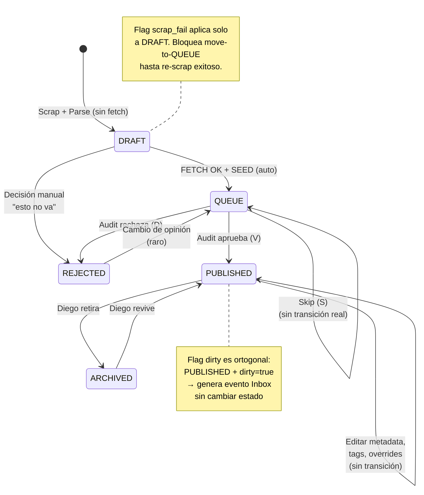
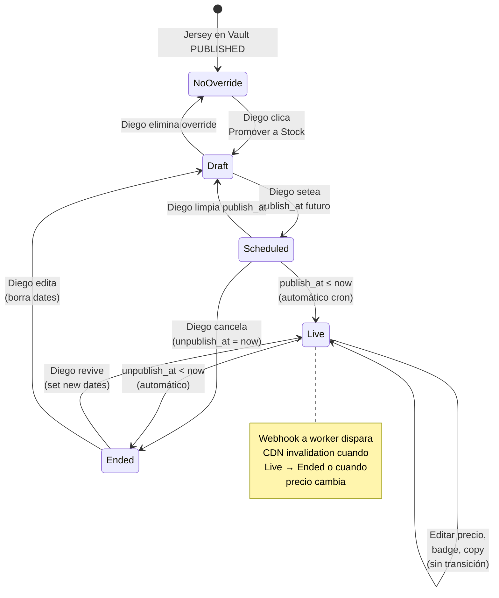
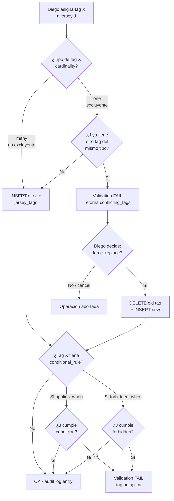
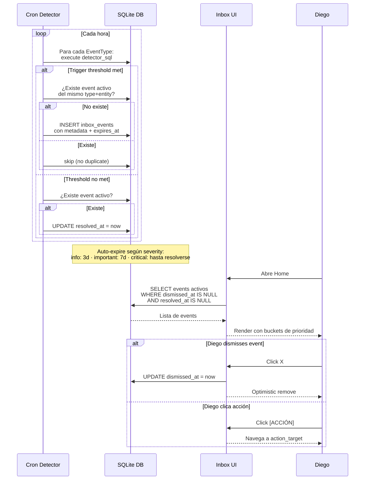
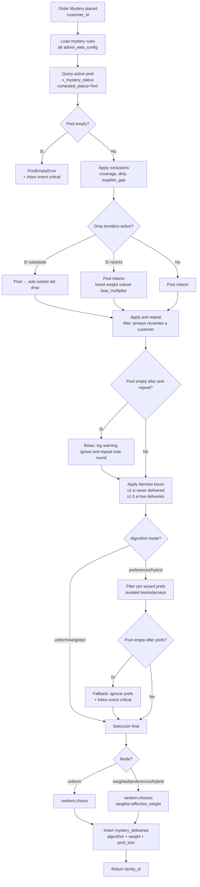

# Admin Web — Cheat Sheet + Diagramas

## 1. Atajos teclado completos

### Globales (cualquier vista)

| Atajo | Acción |
|---|---|
| `⌘K` / `Ctrl+K` | Abre Command Palette (búsqueda + acciones) |
| `g h` | Go to Home |
| `g v` | Go to Vault (último tab) |
| `g s` | Go to Stock |
| `g m` | Go to Mystery |
| `g w` | Go to Site (web) |
| `g c` | Go to Sistema (config) |
| `?` | Mostrar cheat sheet de atajos |
| `Esc` | Cerrar modal/overlay actual |
| `Cmd+B` | Toggle sidebar interno colapsado/expandido |
| `Cmd+,` | Configuración (Sistema > Configuración) |

### Vault > Queue (modo Audit)

| Atajo | Acción |
|---|---|
| `V` | Verify (aprobar la jersey actual) |
| `F` | Flag for ERP review |
| `S` | Skip a la siguiente sin decisión |
| `D` | Delete (con confirm) |
| `↑` / `↓` | Navegar entre jerseys de la queue |
| `j` / `k` | Alt navegar (Vim style) |
| `Tab` | Ciclar modelo primary entre los modelos disponibles |
| `E` | Editar specs panel inline |
| `Shift+T` | Asignar tag (abre modal) |
| `1-9` | Quick set tier (1=T1, 2=T2, etc.) |
| `R` | Re-fetch foto |

### Vault > Publicados / Universo

| Atajo | Acción |
|---|---|
| `/` | Focus search input |
| `Ctrl+A` | Select all visible |
| `Esc` | Deselect todo |
| `Space` | Toggle select item bajo cursor (en table) |
| `Enter` | Abrir modal del item activo |
| `Cmd+E` | Export selection a CSV |
| `Cmd+P` | Promover a Stock (en multi-select) |
| `Cmd+M` | Promover a Mystery (en multi-select) |
| `Cmd+T` | Toggle tag bulk |
| `Cmd+Shift+A` | Archivar bulk |
| `Cmd+Shift+D` | Eliminar bulk (con confirm fuerte) |

### Stock / Mystery — Calendario

| Atajo | Acción |
|---|---|
| `← / →` | Mes anterior / siguiente |
| `T` | Hoy (jump to current month) |
| `1` / `2` / `3` | Toggle Sem / Mes / Trim view |
| `N` | Nuevo drop (modal create) |
| `Click block` | Editar drop |
| `Shift+Click block` | Multi-select drops |
| `Drag block` | Mover fecha (con confirm) |

### Universo (table densa)

| Atajo | Acción |
|---|---|
| `↑↓` | Navegar rows |
| `→ / ←` | Navegar columnas |
| `Space` | Toggle checkbox row |
| `Enter` | Abrir modal del row |
| `Cmd+Click header` | Toggle visibility de columna |
| `Shift+Click header` | Multi-sort (sort secundario) |

### Reglas Mystery modal

| Atajo | Acción |
|---|---|
| `Cmd+S` | Guardar reglas |
| `Cmd+Z` | Reset a defaults |
| `Esc` | Cancelar (sin guardar) |

---

## 2. Diagrama Mermaid: Transiciones de estado del jersey



## 3. Diagrama Mermaid: Flujo de override (Stock/Mystery)



## 4. Diagrama Mermaid: Tag cardinality validation



## 5. Diagrama Mermaid: Pipeline de scrap → Vault

```mermaid
flowchart LR
    A[Diego: Scrap: URL] --> B[Firecrawl Scrape]
    B --> C{¿Markdown<br/>vacío?}

    C -->|Sí L21| D[Fallback HTML directo<br/>scrape-yupoo-direct.mjs]
    C -->|No| E[Normalize Terms]
    D --> E

    E --> F[Wipe non-published<br/>L12 published sagrado]
    F --> G[Parse families]
    G --> H[Fix sleeve mis-labels]
    H --> I[Fetch galleries<br/>FETCH_CONCURRENCY=2]

    I --> J{¿Coverage ≥ 3?<br/>L20 assert}
    J -->|No| K[Add a refetch list]
    J -->|Sí| L[Seed audit_decisions<br/>status='pending']

    K --> M[Re-fetch missing]
    M --> L

    L --> N[Mark qa_priority<br/>desde whitelist]
    N --> O[Generate Pre-Audit HTML]
    O --> P[Diego: revisa flagged]

    P --> Q[Diego pega decisiones]
    Q --> R[Batch Apply<br/>apply-pre-audit-decisions]
    R --> S[ERP Audit Tool<br/>Diego verify/flag/delete]

    S --> T[PUBLISHED]
    S --> U[REJECTED]

    T --> V[vault.elclub.club<br/>público]
```



## 6. Diagrama Mermaid: Inbox events lifecycle



## 7. Diagrama Mermaid: Mystery algorithm flow



## 8. Layout visual de los módulos

```
┌──────────────────────────────────────────────────────────────────────┐
│ ERP TAURI (binario local)                                            │
│ ┌──────────────────────────────────────────────────────────────────┐ │
│ │ Sidebar global: 📦 Admin Web · 💰 Comercial · 📊 Inventario · ...│ │
│ ├──────────────────────────────────────────────────────────────────┤ │
│ │                                                                    │ │
│ │  ADMIN WEB                                                        │ │
│ │  ┌─────────────────┬────────────────────────────────────────────┐│ │
│ │  │ Sidebar interno │  Body activo                                ││ │
│ │  │  🏠 Home        │                                              ││ │
│ │  │  🗄️ Vault       │  ┌──────────────────────────────────────┐  ││ │
│ │  │   ├ Queue       │  │ Module Header + Tabs                 │  ││ │
│ │  │   ├ Publicados  │  ├──────────────────────────────────────┤  ││ │
│ │  │   ├ Grupos      │  │                                        │  ││ │
│ │  │   └ Universo    │  │  Tab content                          │  ││ │
│ │  │  📦 Stock       │  │  (Cards / Tabla densa / Calendario / │  ││ │
│ │  │   ├ Drops       │  │   Editor / etc.)                      │  ││ │
│ │  │   ├ Calendario  │  │                                        │  ││ │
│ │  │   └ Universo    │  └──────────────────────────────────────┘  ││ │
│ │  │  🎲 Mystery     │                                              ││ │
│ │  │   ├ Pool        │  Modal grande FM-style se invoca           ││ │
│ │  │   ├ Calendario  │  desde cualquier jersey row/card           ││ │
│ │  │   └ Universo    │                                              ││ │
│ │  │  🌐 Site        │  Bulk Action Bar slide-up cuando            ││ │
│ │  │   ├ Páginas     │  multi-select activo                         ││ │
│ │  │   ├ Branding    │                                              ││ │
│ │  │   ├ Componentes │                                              ││ │
│ │  │   ├ Comunicación│                                              ││ │
│ │  │   ├ Comunidad   │                                              ││ │
│ │  │   └ Meta+Track  │                                              ││ │
│ │  │  ⚙️ Sistema     │                                              ││ │
│ │  │   ├ Status      │                                              ││ │
│ │  │   ├ Operaciones │                                              ││ │
│ │  │   ├ Configurac. │                                              ││ │
│ │  │   └ Audit       │                                              ││ │
│ │  └─────────────────┴────────────────────────────────────────────┘│ │
│ └──────────────────────────────────────────────────────────────────┘ │
└──────────────────────────────────────────────────────────────────────┘

⌘K Command Palette (overlay) — accesible desde cualquier vista
```

## 9. Color codes leyenda

```
ESTADO PRIMARIO JERSEY:
🟢 PUBLISHED    Verde    Live en sitio público
📥 QUEUE        Amarillo Esperando audit
📝 DRAFT        Gris     Pre-pipeline / scrap_fail
⛔ REJECTED     Rojo     Rechazada definitivamente
💤 ARCHIVED     Gris     Fue published, retirada

OVERRIDE STATUS:
🟢 LIVE         publish_at ≤ now < unpublish_at
⏰ SCHEDULED    publish_at > now
⏸ ENDED        unpublish_at < now
📝 DRAFT        sin publish_at

EVENT SEVERITY (Inbox):
🔴 CRITICAL     Border-left rojo · requiere acción del día
🟠 IMPORTANT    Border-left ámbar · esta semana
🔵 INFO         Border-left azul · sugerencias

FLAGS:
⚠ DIRTY         Jersey publicada con foto rota
🌟 BOOST        Mystery weight con fairness boost activo
🔒 LIMITED      Edición limitada
🎁 EXCLUSIVE    Exclusivo Vault
```

## 10. Comandos de comando palette más comunes

```
⌘K → escribe...

NAVEGACIÓN:
"home"           → Go to Home
"queue"          → Go to Vault > Queue
"publicados"    → Go to Vault > Publicados
"drops"          → Go to Stock > Drops
"calendar"       → Go to Stock > Calendario
"reglas"         → Go to Mystery > Reglas modal
"branding"       → Go to Site > Branding
"status"         → Go to Sistema > Status
"audit log"      → Go to Sistema > Audit

ACCIÓN:
"scrap"          → Trigger scrap nueva categoría
"crear tag"      → Open create tag modal
"crear página"   → Open create page modal
"nuevo drop"     → Open drop creator
"backup ya"      → Trigger backup manual
"deploy"         → Trigger deploy worker

BÚSQUEDA:
"ARG-2026"       → Lista jerseys que matchean
"argentina"      → Jerseys + tag + customer
"mundial"        → Tags + grupos + páginas
"messi"          → Tag narrativa cultural

CONFIG:
"theme"          → Open Branding tab
"shortcuts"      → Open atajos cheat sheet
"logout"         → (a futuro)
```
